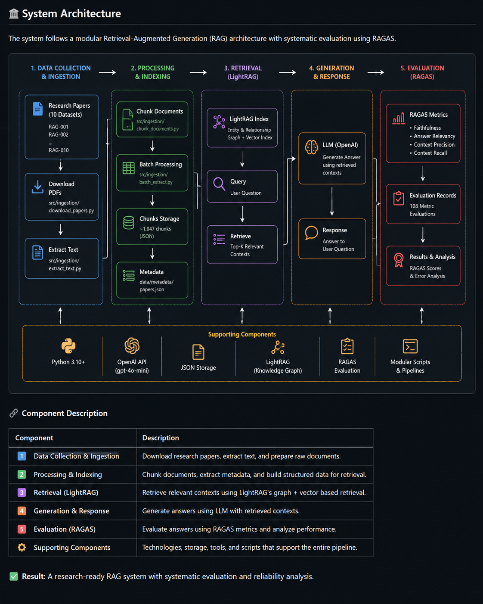

# Research Intelligence RAG

A research-focused Retrieval-Augmented Generation (RAG) system that retrieves relevant information from research-paper datasets, uses LightRAG for knowledge representation and retrieval, generates context-grounded answers with an LLM, and systematically evaluates the results using RAGAS.

The project focuses on building a reproducible research-oriented RAG pipeline with measurable retrieval and generation quality.

---

## Overview

Research Intelligence RAG combines:

- Research-paper document processing
- Document chunking and structured storage
- LightRAG-based knowledge representation
- Entity and relationship retrieval
- Context-aware LLM generation
- RAGAS-based evaluation
- Individual and aggregate evaluation analysis

Instead of relying only on the language model's internal knowledge, the system retrieves information from external research documents and provides that retrieved context to the generation layer.

The final evaluation covers **27 research questions across 10 research-paper datasets** using four RAGAS metrics.

---

## Key Results

| Metric | Score |
|---|---:|
| Faithfulness | **0.7132** |
| Answer Relevancy | **0.9443** |
| Context Precision | **1.0000** |
| Context Recall | **0.9630** |

### Evaluation Summary

- **Research-paper datasets:** 10
- **Evaluation questions:** 27
- **RAGAS metrics:** 4
- **Total metric evaluations:** 108
- **Valid evaluations:** 108 / 108
- **Remaining NaN values:** 0
- **Final evaluation status:** PASS

---

## System Architecture

The system follows a modular Retrieval-Augmented Generation architecture with LightRAG-based retrieval and systematic RAGAS evaluation.



### End-to-End Workflow

```text
Research Papers
      |
      v
Document Processing
      |
      v
Document Chunking
      |
      v
LightRAG Knowledge Representation
      |
      v
Entity / Relationship Retrieval
      |
      v
Relevant Research Context
      |
      v
LLM Generation
      |
      v
Generated Answer
      |
      v
RAGAS Evaluation
      |
      +-------------------+
      |       |       |   |
      v       v       v   v
 Faith.   Answer   Context  Context
          Rel.    Precision Recall
Pipeline Components
Data Collection & Ingestion
Research-paper datasets are collected and organized.
Source documents are prepared for processing.
Processing & Indexing
Documents are extracted and divided into chunks.
Structured metadata and chunk information are stored.
Retrieval — LightRAG
LightRAG builds knowledge representations using entities and relationships.
Queries are processed through local and global retrieval.
Relevant entities, relationships, and document chunks are selected.
Generation
Retrieved research context is supplied to the LLM.
The LLM generates an answer grounded in the retrieved information.
Evaluation — RAGAS
Generated responses are evaluated using four RAGAS metrics.
Individual evaluation results are preserved.
Aggregate scores are calculated and validated.
Project Objectives

The main objectives of the project are:

Build a research-oriented RAG pipeline using real research papers.
Organize research documents into reproducible datasets.
Process and chunk research documents for retrieval.
Build structured knowledge representations using LightRAG.
Generate research questions grounded in the collected papers.
Retrieve supporting evidence for each question.
Generate answers using retrieved research context.
Evaluate the generated answers using RAGAS.
Analyze individual metric results.
Investigate and resolve evaluation failures without modifying the underlying research dataset.
Produce a final validated evaluation artifact.
Research Dataset

The research collection is organized into 10 datasets:

RAG-001
RAG-002
RAG-003
RAG-004
RAG-005
RAG-006
RAG-007
RAG-008
RAG-009
RAG-010

The processed collection contains approximately:

Research-paper datasets : 10
Total document chunks   : 1,047
Empty chunks             : 0
Invalid chunks           : 0

The datasets cover research topics related to:

Retrieval-Augmented Generation
Self-RAG
Adaptive-RAG
GraphRAG
HYBGRAG
LightRAG
CoRAG
RAG evaluation
RAGAS
RAGChecker
Evaluation Dataset

The final evaluation contains:

Research-paper datasets : 10
Evaluation questions    : 27
RAGAS metrics           : 4
Total evaluations       : 108

Each evaluation record contains information such as:

user_input
retrieved_contexts
response
reference
faithfulness
answer_relevancy
context_precision
context_recall
LightRAG Retrieval

LightRAG is used as the knowledge-representation and retrieval layer of the system.

The retrieval process can combine:

Entities
Relationships
Knowledge-graph information
Document-level evidence
Relevant document chunks

The system performs query processing using LightRAG's retrieval mechanisms and constructs a final context that is supplied to the generation model.

Example LightRAG Execution

The following output demonstrates an actual LightRAG query execution, including retrieved entities, relationships, context selection, and the generated answer.

The execution output demonstrates:

Local query
Global query
Entity retrieval
Relationship retrieval
Vector-based context selection
Final context construction
LLM generation
Generated answer
RAG Evaluation Methodology

The system evaluates the generated responses using four RAGAS metrics.

1. Faithfulness

Faithfulness measures whether the claims made in the generated response are supported by the retrieved context.

A higher score indicates that the generated response is more grounded in the retrieved evidence.

Final score: 0.7132

2. Answer Relevancy

Answer Relevancy measures how relevant the generated response is to the user's question.

A higher score indicates that the response more directly addresses the question.

Final score: 0.9443

3. Context Precision

Context Precision measures how relevant the retrieved context is with respect to the information required to answer the question.

Final score: 1.0000

4. Context Recall

Context Recall measures how much of the required information was successfully retrieved into the context.

Final score: 0.9630

Final RAGAS Evaluation

The final frozen evaluation contains 27 valid samples evaluated across all four RAGAS metrics.

Samples evaluated : 27
Metrics           : 4
Valid evaluations : 108 / 108

Final Scores
Faithfulness       : 0.7132
Answer Relevancy   : 0.9443
Context Precision  : 1.0000
Context Recall     : 0.9630
Validation
Faithfulness NaN       : 0
Answer Relevancy NaN   : 0
Context Precision NaN : 0
Context Recall NaN    : 0

FINAL EVALUATION STATUS: PASS
Individual Evaluation Results

The project also generates an individual evaluation report containing the scores for each research question.

Each evaluation record contains:

RAG ID
Question
Faithfulness
Answer Relevancy
Context Precision
Context Recall

The evaluation set contains questions covering topics such as:

Core RAG architecture
Retrieval challenges
Hallucination mitigation
SELF-RAG
Adaptive-RAG
GraphRAG
HYBGRAG
LightRAG
CoRAG
RAGAS
RAGChecker

This allows the aggregate scores to be inspected at the individual-question level.

Faithfulness Evaluation Issue and Resolution

During the original batch evaluation, several Faithfulness evaluations returned NaN.

The failure was investigated and traced to the structured-output / NLI stage of the RAGAS evaluation process, where some responses resulted in an IncompleteOutputException.

The underlying research dataset and successful evaluation results were preserved.

Repair Strategy

A separate Faithfulness evaluation context was prepared.

The previously failed Faithfulness evaluations were then processed in smaller batches.

Only the failed Faithfulness rows were re-evaluated.

Original Faithfulness NaN rows : 17
Re-evaluated rows              : 17
Remaining NaN rows             : 0

This approach avoided unnecessarily rerunning the complete evaluation and preserved the existing successful metric results.

The repaired evaluation was then written to a separate final JSON artifact.

Final Evaluation Artifact

The final verified evaluation file is:

ragas_batch_rag002_010_FINAL.json

This artifact contains:

All 27 evaluation samples
User questions
Retrieved contexts
Generated responses
Reference answers
Faithfulness scores
Answer Relevancy scores
Context Precision scores
Context Recall scores

The original evaluation output was preserved separately during the repair process.

Technology Stack
Core
Python 3.10+
Retrieval-Augmented Generation (RAG)
LightRAG
Large Language Models (LLMs)
Retrieval & Knowledge Representation
LightRAG
Entity retrieval
Relationship retrieval
Knowledge-graph representation
Vector-based retrieval
Evaluation
RAGAS 0.4.3
Faithfulness
Answer Relevancy
Context Precision
Context Recall
Data & Processing
JSON
Research-paper documents
Document chunks
Structured retrieval contexts
Metadata
Model Services
OpenAI API
GPT-4o-mini
text-embedding-3-small
Project Structure

The repository is organized around data processing, retrieval, evaluation, and reporting.

research-intelligence-rag/
│
├── data/
│   └── metadata/
│       └── papers.json
│
├── docs/
│   └── images/
│       ├── system-architecture.png
│       ├── lightrag-retrieval.png
│       ├── final-ragas-evaluation.png
│       └── individual-ragas-results.png
│
├── src/
│   ├── ingestion/
│   │   ├── download_papers.py
│   │   ├── extract_text.py
│   │   ├── chunk_documents.py
│   │   ├── batch_extract.py
│   │   └── batch_chunk.py
│   │
│   ├── retrieval/
│   │   ├── lightrag_batch.py
│   │   └── query_lightrag.py
│   │
│   └── evaluation/
│
├── RAG-001.txt
├── RAG-002.txt
├── ...
├── RAG-010.txt
│
├── ragas_batch_rag002_010_data.json
├── ragas_batch_rag002_010_results.json
├── ragas_batch_rag002_010_FINAL.json
│
├── ragas_rag001_data.json
├── ragas_rag001_results.json
│
├── faithfulness_evaluation_data.json
├── ragas_batch_rag002_010_faithfulness_fixed.json
│
├── batch_questions_rag002_010.py
├── prepare_ragas_batch_rag002_010.py
├── prepare_ragas_rag001.py
│
├── run_ragas_batch_rag002_010.py
├── run_ragas_rag001.py
│
├── repair_faithfulness_final.py
├── final_results_report.py
├── individual_results_report.py
│
├── inspect_context.py
├── inspect_ragas_llm.py
├── check_faithfulness.py
├── check_faithfulness_context.py
├── check_vector_paths.py
│
├── .gitignore
└── README.md

Additional diagnostic and helper scripts may be present in the development workspace.

Reproducibility

The evaluation workflow was designed to keep the original evaluation dataset separate from the repaired Faithfulness evaluation.

The final evaluation artifact can therefore be inspected independently without rerunning the complete RAGAS pipeline.

The repository contains scripts used for:

Preparing evaluation data
Running batch evaluation
Inspecting retrieved contexts
Checking Faithfulness
Repairing failed Faithfulness evaluations
Producing final evaluation reports
Producing individual question-level results

This separation makes it possible to inspect the final evaluation independently from the repair process.

Evaluation Reliability

The final evaluation includes:

27 questions
×
4 metrics
=
108 metric evaluations

All 108 evaluations contain valid metric values in the final artifact.

Faithfulness NaN       : 0
Answer Relevancy NaN   : 0
Context Precision NaN : 0
Context Recall NaN    : 0

Therefore, the final evaluation dataset contains no missing metric values.

Limitations

The current evaluation has several limitations:

The evaluation set contains 27 questions.
The questions cover the selected research-paper collection rather than the entire RAG research domain.
RAGAS scores depend on the evaluator model and evaluation configuration.
Retrieval quality depends on the quality and structure of the underlying research documents.
LightRAG retrieval behavior can depend on knowledge representation and indexing quality.
A high aggregate metric does not guarantee that every individual response is perfect.
Automated evaluation does not completely replace human assessment.
Future Improvements

Potential improvements include:

Expand the research-paper collection.
Increase the number and diversity of evaluation questions.
Compare LightRAG with alternative retrieval architectures.
Perform retrieval ablation studies.
Compare different embedding models.
Compare different generator models.
Experiment with different retrieval configurations.
Add human evaluation alongside automated RAGAS evaluation.
Track evaluation results across multiple system configurations.
Analyze retrieval latency and token usage.
Add automated experiment tracking.
Build a user-facing research question-answering interface.
Conclusion

Research Intelligence RAG provides a structured workflow for research-oriented retrieval and generation.

The system combines research-paper processing, LightRAG knowledge representation, entity and relationship retrieval, LLM-based answer generation, and systematic RAGAS evaluation.

The final evaluation covers:

10 research-paper datasets
27 evaluation questions
4 RAGAS metrics
108 valid metric evaluations
0 remaining NaN values
Final Aggregate Scores
Faithfulness       : 0.7132
Answer Relevancy   : 0.9443
Context Precision  : 1.0000
Context Recall     : 0.9630

The project therefore provides both a research-oriented RAG workflow and a reproducible evaluation artifact for analyzing retrieval and generation quality.

Evidence

The repository includes visual evidence of the major project components.

System Architecture

The architecture diagram shows the complete pipeline from research-paper ingestion through document processing, LightRAG retrieval, LLM generation, and RAGAS evaluation.

LightRAG Retrieval

The LightRAG execution screenshot demonstrates query processing, retrieved entities and relationships, context selection, and generated output.

RAGAS Evaluation

The final RAGAS evaluation screenshot demonstrates the evaluation process with 27 samples, 108 valid metric evaluations, final metric scores, and zero remaining NaN values.

Author

Syed Shahed

Research Intelligence RAG

Technologies: Python • RAG • LightRAG • RAGAS • LLMs • Information Retrieval
